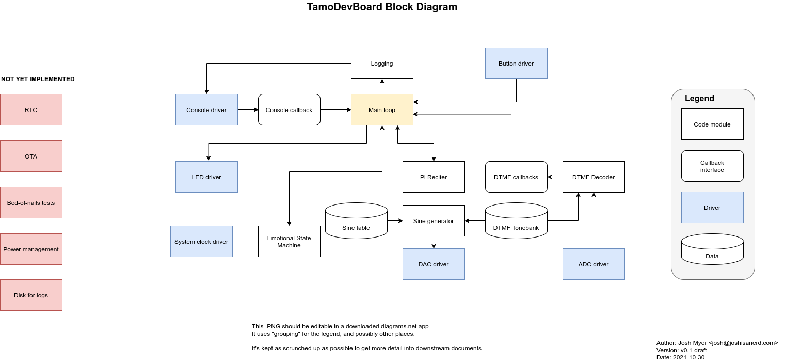

# SchmancyBlink Overview

This file is an overview of SchmancyBlink, aka TamoDevBoard.  It's the
first demo of the argali framework, but is also an entirely plausible
product in its own right.

## Product overview

Your devboard has a somewhat rich inner life. It is lonely when no one
is around, but when it detects that a person is nearby, it becomes
happy for a while. But if that person is around too long, it gets
bored.  While a person is around, it remains bored. After the person
has left, however, it will eventually become lonely again.

When it is bored, it recites recites digits of pi to itself, as DTMF
tones.  It decodes these, and only proceeds to the next digit once
it's satisfied that anyone as smart as it would have understood what
it was saying.  Of course, as the user is clearly not, this is a
pointless endeavor that only helps us to further identify with it as
it goes through the process of growing into a mature product.

## Implementation overview

This is implemented as a set of state machines and callbacks, with
minimal direct code.  Decoupling things this way helps with
platform-independence and minimizing the context needed to understand
a single subsystem.  However, it makes it harder to get a full
overview of the system, and makes clean documentation more important.

### Block diagram

### Main loop

This sets things up, and then runs a periodic loop to advance things
asynchronously of callbacks.  Most callbacks in this system are called
from ISRS, so they need to be quick.  Therefore, we have them do the
least work possible and use shared state with the main loop to drive
them forward.

### Drivers

A lot of the implementation is concerned with device drivers for the
various peripherals found on the devboards.  We currently support
Nucleo F767ZI and Nucleo 413ZH devboards, but (clean and meaingfully
tested) contributions are welcome for more.  libopencm3's API is a bit
hairy, and the examples repo undergoes a great deal of gatekeeping, so
we can use this as a worked example for lots of other systems out
there.

For more detail on specific drivers, see their implementation files
for a run-down on how they are implemented.  The current architecture
leans very heavily on the DMA capabilities shared between the STM32F4
and STM32F7 family; if your micro doesn't support that, it may be
challenging to integrate in.

## Emotional State Machine

This is the guts of the logic, found in [tamo_state.c].  It is a pure
logic implementation, which makes it very easy to test thoroughly in
the docker containers.  This is a pretty trivial state machine, but it
does a good job of capturing the personality of our devboards.

## Pi Reciter

This is a different sort of state machine, which works its way through
the digits of pi.  It also confirms each digit has round-tripped
through the DTMF correctly; if not, it gets frustrated and stuck in a
loop of `AAAAAA` until it's reset.  It only knows so many digits, and
emits `#` when it has completed entering the number.

## Sine Wave Generator

The least-common-denominator DAC only support 8b output, so we have a
sine table that can be used to generate a sine wave at full resolution
within this limitation.  This is also fully unit tested on the build
host, which is particularly handy, as there are lots of corner cases
in our implementation.  (Ironically, a lot of these corner cases
happen around 90deg.)

## DTMF Modulator/Demodulator

In order to let TamoDevBoard fully express itself, it needs the
ability to emit and decode DTMF tones.  For generating the tones, it's
easy: we have a table of the pairs of tones to emit for each DTMF
symbol, and have the sine generator fill a DAC buffer for us.

For decoding DTMF, we follow ST's Design Tip DT0089 and implement a
bank of Goertzel filters.  This allows us to detect the 8 DTMF tones
in a very efficient manner, and then decode the symbols from the
detected signal strengths.

## TODO

### RTC Support

We currently do a very janky busy loop approximation of time.  These
devices all have RTCs, and we should use them.  This is a prerequisite
for lower power modes, as it lets us change system clock speeds
without having to adjust our perception of time.

### Power management

This is a fairly invasive change, but very much worth it.  There are
two sorts of power management being consciously conflated here: lower
speed operation and sleep modes.  Each has its challenges, and both
are beyond the current scope of this project.

### Disk for logging

TamoDevBoard would like to keep a journal of its disappointments with
people, but currently can only log off into the void.  While this is a
form of catharsis with a distinctly satisfying aesthetic, it would be
good to be able to write things down for longer-term storage as well.

This will require adding a QSPI driver for the typical flash chips and
a filesystem.  It will also need to deal with overfull FSes, etc.

### OTA updating

A common need in embedded products is firmware updating.  We currently
have no provision for that, but we should do so at some point.  Having
a disk would be very helpful for this, as it would allow us to store a
firmware image to update, as well as a backup of the current firmware.

This will require coding up a quick bootloader that includes the disk
driver, which is currently outside the scope, but would be great to
have.

### Bed of nails tests

Any product that's being fully produced on an assembly line will need
EOL testing.  Having support for that baked into TamoDevBoard will be
very helpful once we want to inflict a billion of them upon the world.
